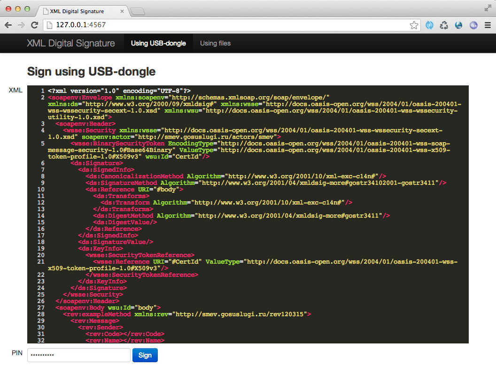

web-xml-signer
==============

Web app to sign any XML document using XML Digital Signature with the help of USB tokens or key/certificate files.

Usage
-----

Install [browser plugin](https://esia.gosuslugi.ru/sia-web/plugin/upload/Index.spr) that includes support for PKCS11 USB tokens (eToken, ruToken, and others).

Start the app as any other Sinatra app:

    $ ruby app.rb

Enjoy!
